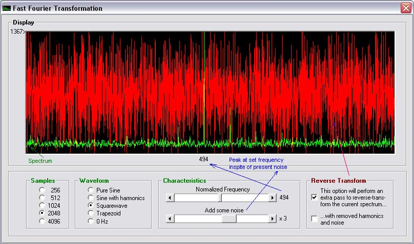



## Fast Fourier Transformation and Inverse Fast Fourier Transformation \(FFT &amp; IFFT\) Class

### Description

Class and exhaustive test rig for FFT and IFFT. See screenshot. Updated for substantial speed improvemnt. Download is 8 kB
 
### More Info
 

             |
---                |---
**Submitted On**   |2006-04-04 14:31:22
**By**             |[ULLI](https://github.com/Planet-Source-Code/PSCIndex/blob/master/ByAuthor/ulli.md)
**Level**          |Advanced
**User Rating**    |5.0 (100 globes from 20 users)
**Compatibility**  |VB 6\.0
**Category**       |[Libraries](https://github.com/Planet-Source-Code/PSCIndex/blob/master/ByCategory/libraries__1-49.md)
**World**          |[Visual Basic](https://github.com/Planet-Source-Code/PSCIndex/blob/master/ByWorld/visual-basic.md)
**Archive File**   |[Fast\_Fouri198558462006\.zip](https://github.com/Planet-Source-Code/ulli-fast-fourier-transformation-and-inverse-fast-fourier-transformation-fft-amp-ifft-clas__1-64918/archive/master.zip)

